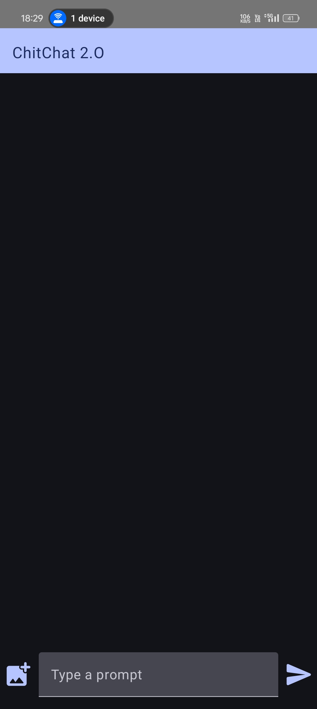

# ChitChat2O - Chatbot App

ChitChat2O is an AI-powered chatbot application built using Kotlin and the Gemini API. This app provides a seamless chat interface with the added capability for users to upload and share images during conversations.

## Table of Contents

- [Features](#features)
- [Images](#images)
- [Technologies Used](#technologies-used)
- [Images](#images)
- [Installation](#installation)
- [License](#license)
- [Author](#author)


## Features

- **Interactive Chat Interface**: The app allows users to engage in a conversational experience with an AI chatbot.
- **Image Upload**: Users can upload images directly from their device to share in the chat.
- **Responsive Design**: The app's UI is designed to provide a smooth user experience, featuring a modern chat screen with support for text and media.
- **Customizable Themes**: The app is built using Jetpack Compose with support for Material3 themes.

## Images
<p align="center">
    
    
</p>
<p align="center">
    
    
</p>

## Technologies Used

- **Kotlin**: The app is written in Kotlin, leveraging Android's latest features.
- **Gemini API**: Utilizes the Gemini API to power intelligent conversations.
- **Jetpack Compose**: For designing the UI in a declarative way.
- **Coil**: For loading and displaying images efficiently.
- **Coroutines**: To manage asynchronous tasks.

## How to Use

1. **Send Text Messages**: Type your prompt in the input field and click on the "Send" button to interact with the AI.
2. **Upload and Share Images**:
   - Click on the "Add Photo" icon to pick an image from your device.
   - Once selected, the image will be displayed alongside your message.

## Installation

1. Clone the repository:
   ```bash
   git clone https://github.com/your-repo/chitchat2o.git
   ```
2. Open the project in Android Studio.
3. Build and run the app on your Android device or emulator.


## License

This project is licensed under the MIT License - see the [LICENSE](LICENSE) file for details.

## Author

Abhishek Rajput
